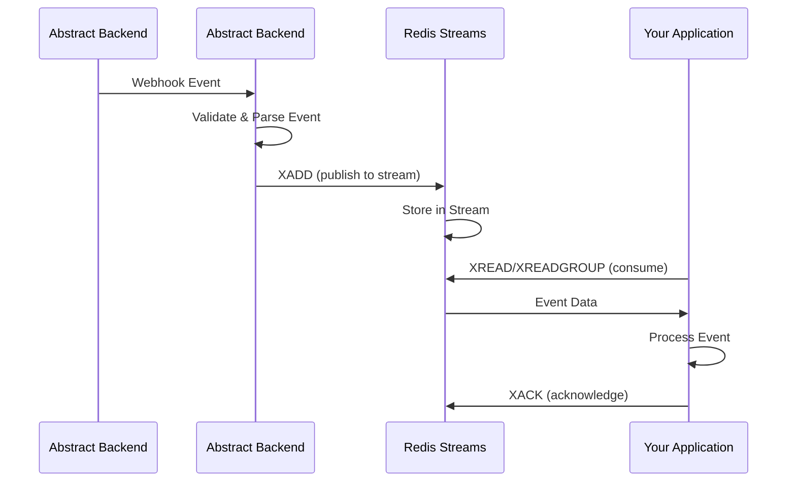

# Redis Message Queue Backend for Abstract Backend

Welcome to **abe-redis** - a production-ready Redis-based message queue backend implementation for the [Abstract Backend](https://github.com/Chisanan232/abstract-backend) project.

## What is abe-redis?

**abe-redis** is a Redis Streams-based message queue backend that integrates seamlessly with the Abstract Backend's webhook-based event transfer system. It provides a reliable, scalable, and high-performance solution for handling Abstract Backend events using Redis as the message queue infrastructure.

## The Abstract Backend Integration

The [Abstract Backend](https://github.com/Chisanan232/abstract-backend) is designed with a flexible, plugin-based architecture that supports webhook features to transfer Abstract Backend events through customizable message queue systems. This Redis backend can be installed via `pip install abe-redis` and used immediately with minimal configuration.

### Event Flow Architecture

The Abstract Backend processes events through the following flow:

1. **Abstract Backend Event Reception**: Abstract Backend sends webhook events to the MCP Server
2. **Event Processing**: The MCP Server receives and validates the event
3. **Queue Backend Selection**: Based on `QUEUE_BACKEND=redis` environment variable
4. **Message Publishing**: Event is published to Redis Streams
5. **Consumer Processing**: Your application consumes and processes events from Redis
6. **Response Handling**: Results are sent back through the system



### Plugin Discovery System

The Abstract Backend uses Python's entry points system for plugin discovery. The Redis backend is registered as:

```toml
[project.entry-points."abstract_backend.backends.queue"]
redis = "abe_plugin.backends.queue.redis:RedisMessageQueueBackend"
```

When you set `QUEUE_BACKEND=redis` in your environment, the MCP Server automatically discovers and loads the Redis backend.

## Redis Backend Architecture

### Redis Streams Implementation

The Redis backend uses **Redis Streams** for reliable message queueing with the following features:

- **Persistent Storage**: Messages are stored in Redis Streams with configurable retention
- **Consumer Groups**: Support for distributed consumption across multiple workers
- **Automatic Acknowledgment**: Messages are acknowledged after successful processing
- **Stream Pattern Matching**: Automatically discovers and consumes from `slack:*` streams
- **Connection Pooling**: Efficient connection management with configurable pool size

### Core Operations

```python
from abe_plugin.backends.message_queue import RedisMessageQueueBackend

# Initialize from environment
backend = RedisMessageQueueBackend.from_env()

# Publish a message
await backend.publish("slack:events", {"type": "message", "text": "Hello"})

# Consume messages (simple mode)
async for message in backend.consume():
    print(message)

# Consume with consumer groups (distributed mode)
async for message in backend.consume(group="workers"):
    print(message)
```

### Environment-Based Configuration

The Redis backend supports configuration through environment variables:

```bash
# Required
export REDIS_URL="redis://localhost:6379/0"

# Optional
export REDIS_PASSWORD="your_password"        # Redis authentication
export REDIS_SSL="true"                       # Enable SSL/TLS
export REDIS_MAX_CONNECTIONS="10"             # Connection pool size
export REDIS_STREAM_MAXLEN="10000"            # Max stream length

# Backend selection
export QUEUE_BACKEND="redis"
```

### Asynchronous Processing

All Redis operations are fully asynchronous using `redis.asyncio` for non-blocking event processing:

```python
# Asynchronous publishing
await backend.publish("slack:events", event_data)

# Asynchronous consumption with async iteration
async for message in backend.consume():
    # Process message without blocking
    await process_event(message)

# Graceful shutdown
await backend.close()
```

## Key Features & Benefits

### 🔌 **Plug-and-Play Integration**
- **Zero Configuration**: Install and set `QUEUE_BACKEND=redis` to start
- **Auto-Discovery**: Automatically discovered by Abstract Backend
- **Drop-in Replacement**: Works with existing Abstract Backend installations

### ⚡ **High-Performance Redis Streams**
- **Asynchronous Operations**: Non-blocking message processing with `redis.asyncio`
- **Scalable Design**: Horizontal scaling with consumer groups
- **Efficient Streaming**: Redis Streams for reliable message delivery
- **Connection Pooling**: Configurable connection pool for optimal performance

### 🛠️ **Developer-Friendly**
- **Type Safety**: Full typing support with mypy
- **Comprehensive Examples**: Working examples in `examples/` directory
- **Detailed Logging**: Built-in logging for debugging and monitoring
- **Modern Python**: Python 3.12+ with async/await patterns

### 📦 **Production-Ready**
- **PyPI Distribution**: Install with `pip install abe-redis`
- **CI/CD Workflows**: Automated testing and publishing
- **Test Coverage**: Comprehensive unit and integration tests
- **Security**: Regular dependency updates and security scanning

### 🔒 **Enterprise Features**
- **Consumer Groups**: Distributed message processing across workers
- **Message Acknowledgment**: Automatic XACK for processed messages
- **Stream Trimming**: Configurable MAXLEN to prevent unbounded growth
- **SSL/TLS Support**: Secure connections to Redis
- **Authentication**: Password-based Redis authentication

## Why Redis Streams?

Redis Streams provides the perfect balance of simplicity and power for Abstract Backend event processing:

### **Reliability**
- **Persistent Storage**: Messages survive Redis restarts
- **Consumer Groups**: Guaranteed message delivery with acknowledgments
- **At-Least-Once Delivery**: Messages are redelivered if not acknowledged

### **Performance**
- **In-Memory Speed**: Sub-millisecond latency for most operations
- **High Throughput**: Handle thousands of events per second
- **Efficient Storage**: Optimized data structure for streaming data

### **Scalability**
- **Horizontal Scaling**: Add more consumers to handle increased load
- **Consumer Groups**: Distribute work across multiple workers
- **Pattern Matching**: Automatically discover and consume from multiple streams

### **Operational Simplicity**
- **Easy Deployment**: Single Redis instance or cluster
- **Monitoring**: Built-in Redis monitoring tools
- **Backup & Recovery**: Standard Redis persistence options (RDB, AOF)

## Use Cases & Scenarios

### **Single Worker (Development)**
```bash
# Install the package
pip install abe-redis

# Start Redis
docker run -d -p 6379:6379 redis:7-alpine

# Configure and run
export QUEUE_BACKEND=redis
export REDIS_URL=redis://localhost:6379/0
python -m abstract_backend_server
```

### **Distributed Workers (Production)**
```bash
# Install on all worker nodes
pip install abe-redis

# Configure for production Redis
export QUEUE_BACKEND=redis
export REDIS_URL=redis://prod-redis:6379/0
export REDIS_PASSWORD=secure_password
export REDIS_SSL=true

# Run multiple workers with consumer groups
python your_consumer.py --group=workers
```


## Getting Started

Get up and running with the Redis backend in minutes:

### ✅ **Quick Installation**
```bash
pip install abe-redis
```

### ✅ **Basic Configuration**
```bash
export QUEUE_BACKEND=redis
export REDIS_URL=redis://localhost:6379/0
```

### ✅ **Start Using**

```python
from abe_plugin.backends.message_queue import RedisMessageQueueBackend

backend = RedisMessageQueueBackend.from_env()
await backend.publish("slack:events", {"type": "message"})
```

### ✅ **Run Examples**
```bash
# Start Redis
docker run -d -p 6379:6379 redis:7-alpine

# Run the example
python examples/basic_usage.py
```

## Next Steps

Ready to use the Redis backend? Follow our comprehensive guide:

1. 🚀 **[Quick Start](./quick-start/)** - Install, configure, and use the Redis backend
2. 📋 **[Requirements](./quick-start/requirements)** - System and software prerequisites
3. 🛠️ **[Installation](./quick-start/installation)** - Detailed installation instructions
4. 📚 **[API Reference](./api-references/)** - Detailed API documentation
5. 🤝 **[Contributing](./contribute/)** - Help improve the Redis backend

Let's process Abstract Backend events with Redis! 🚀
